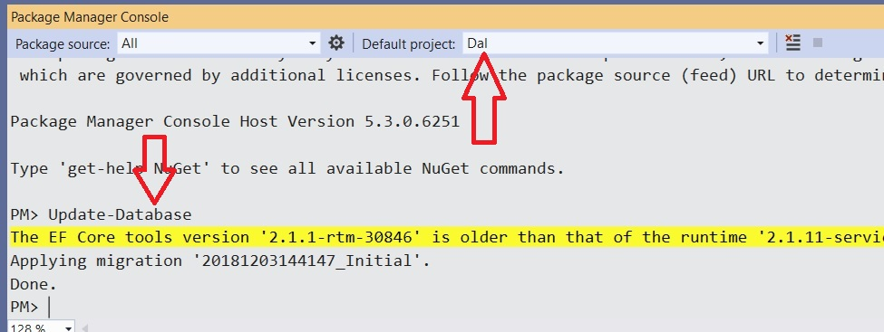
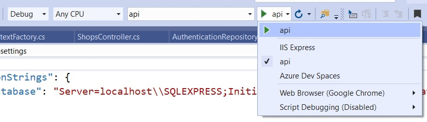

# Debriefing API    

Ce projet donne quelques exemples des problématiques abordées durant les laboratoires (DAL, Documentation, identification, autorisation, CORS, optimistic offline lock).

## Mise en route

Recompilez la solution. Ca devrait avoir pour effet de restaurer les packages manquants. 

La DAL utilise EF Core Code First. Vous pouvez créer la DB (SQL Server) en utilisant la commande Update-Database depuis le Package Manager Console de Visual Studio. Au préalable, veuillez vérifier et au besoin adapter la connection string (voir classe DesignTimeContextFactory et fichier appsettings.json du projet DAL).

Il vous est possible d'utiliser ce projet de manière statique: comprenez où sont définies les classes, où elles sont utilisées et dans quel but.

Si vous souhaitez exécuter l'API, sachez que la connection string doit être vérifiée dans le fichier appsettings.json du projet API. 

## Identification

Ce projet utilise une identification basée sur les tokens JWT stateless. La base de données des utilisateurs est constituée d'un ensemble hardcodé d'utilisateurs. Ex: janedoe/123

## Debugging

Lancez l'app sans passer par IIS Express. 

Examinez ensuite le port sur lequel l'API écoute les requêtes

Testez un premier appel

> http://127.0.0.1:5001/api/Shops

Il devrait se solder par un 401. Réitérez l'expérience avec un jeton JWT valide.

## Swagger

L'API expose une documentation Swagger accessible à l'URL suivante 

http://127.0.0.1:5001/swagger/index.html

